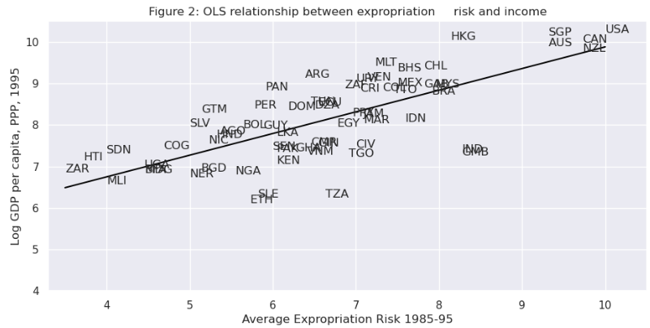
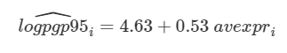
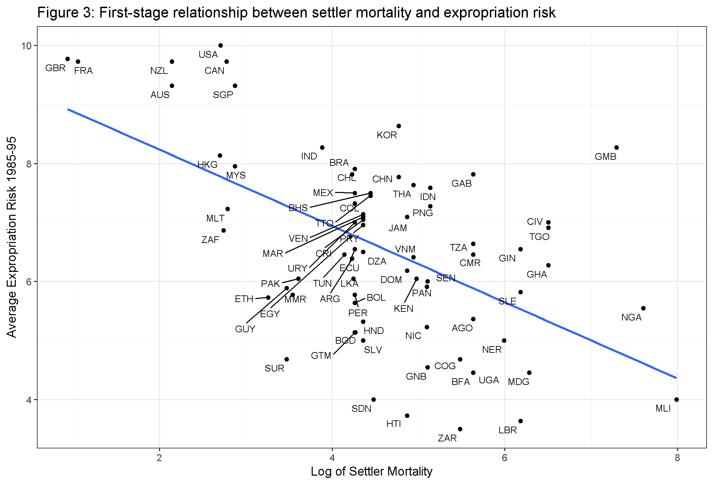
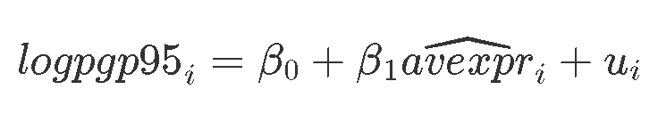

```{r setup, include=FALSE}
knitr::opts_chunk$set(echo = TRUE)
```

# 1. Introduction and Objectives

The primary goal of this analysis is to reproduce and enhance a data
analysis and regression originally conducted using Python and the Pandas
library, as detailed in an article published on QuantEcon. This project
aims to determine whether differences in institutions can help to
explain observed economic outcomes.

In the original study, the authors utilized the Python package
`statsmodels` to estimate, interpret, and visualize linear regression
models. They focused on several key topics, including simple and
multivariate linear regression, visualization, endogeneity and omitted
variable bias, and two-stage least squares.

As an example, the original analysis replicates results from the seminal
paper by Acemoglu, Johnson, and Robinson (2001). The authors emphasized
the importance of institutions in economic development, using settler
mortality rates as a source of exogenous variation in institutional
differences. This variation helps determine whether institutions give
rise to greater economic growth or if the relationship is reversed.

The specific economic outcomes in the analysis are proxied by the
logarithm of GDP per capita in 1995, adjusted for exchange rates.
Institutional differences are proxied by an index of protection against
expropriation on average over 1985-1995, constructed by the Political
Risk Services Group.

Our main objectives were:

-   **Reproduction**: To accurately replicate the original analysis
    using R to ensure the results are consistent with those obtained in
    Python.

-   **Enhancement**: To improve the analysis by including additional
    steps such as handling missing values, refining variable selection,
    and any other modifications that arise during the analysis.

# 2. Methodology

We will translate the original Python code to R and perform the analysis
using RStudio and GitHub for collaboration. The final report will be
presented in R Markdown to ensure reproducibility and clarity.

## 2.1 Data

The data used in this analysis is taken from the authors' site and is
exactly the same as that used in their original analysis. This ensures
that any differences in the results can be attributed to the differences
between the Python and R implementations of the analysis.

## 2.2 Tools Used

-   **RStudio**: For coding and analysis.
-   **GitHub**: For version control and collaboration.
-   **R Markdown**: For documenting and presenting the analysis.

# 3. Report Outline

The report is structured as follows:

-   **Data Overview**: A comprehensive look at the data used in the
    analysis.
-   **Data Preparation**: Steps taken to clean and preprocess the data.
-   **Simple Linear Regression Model**: Analysis of the basic linear
    relationship between the variables.
-   **Multivariate Regression Model**: Examination of the multiple
    linear relationships and their interactions.
-   **Endogeneity (Two-stage Least Squares (2SLS) Regression Model)**:
    Addressing potential endogeneity issues using a two-stage regression
    approach.
-   **Summary**: Conclusions and insights derived from the analysis.

Through this project, we aim to not only replicate the original findings
but also explore potential improvements and document any differences in
the results due to the use of R instead of Python.

# 4. Data overview

In this section, we provide an overview of the dataset used in our
analysis. The data is sourced directly from the QuantEcon repository,
ensuring consistency with the original analysis.

Before starting, first we should install all necessary packages,

```{r message=FALSE, warning=FALSE}
#install(haven)
#install(dplyr)
#install(ggplot2)
#install(ggrepel)
#install(broom)
#install(stargazer)
#install(knitr)
#install(lmtest)
#install(AER)
#install(ggrepel)
```

and load them into memory.

```{r message=FALSE, warning=FALSE}
library(haven)
library(dplyr)
library(ggplot2)
library(ggrepel)
library(broom)
library(stargazer)
library(knitr)
library(lmtest)
library(AER)
library(ggrepel)
```

Now let's import the data and have a look on it.

```{r message=FALSE, warning=FALSE}
df <- read_dta('https://github.com/QuantEcon/lecture-python/blob/master/source/_static/lecture_specific/ols/maketable1.dta?raw=true')
head(df)
```

The dataset consists of various columns, each representing different
variables used in the regression analysis. As shown, the dataset
includes the following key variables:

-   `shortnam`: Country code (e.g., AFG for Afghanistan, AGO for
    Angola).
-   `euro1900`: European settler mortality rates in 1900.
-   `excolony`: Indicator variable for whether the country was a former
    colony.
-   `avexpr`: Average protection against expropriation risk (1985-1995).
-   `logpgp95`: Logarithm of GDP per capita in 1995.
-   `cons1`, `cons90`, `cons00a`, `cons00aa`: Various measures of
    constraint on the executive.
-   `democ00a`: Democracy indicator.
-   `extmort4`: European settler mortality rates.
-   `logem4`: Log of European settler mortality rates.
-   `loghjypl`: Log of income per capita from Hall and Jones (1999).
-   `baseco`: Indicator for the base sample used in the analysis.

From the initial data preview, we observe that there are missing values
in several columns, such as `avexpr` and `logpgp95`. This highlights the
need for careful data cleaning and preparation before proceeding with
the regression analysis.

The dataset includes key indicators for economic outcomes and
institutional differences, which will be pivotal in our subsequent
regression models. Specifically, `logpgp95` serves as the dependent
variable representing economic outcomes, while `avexpr` captures the
institutional differences.

In the following sections, we will detail the data preparation steps to
handle these missing values and ensure the dataset is ready for
regression analysis.

# 5. Data preparation

In this section, we outline the steps taken to prepare the dataset for
analysis. Proper data preparation is essential to ensure the reliability
and validity of the regression models.

To begin, we generate a summary of the dataset to understand the
distribution and presence of any missing values across the variables.

```{r message=FALSE, warning=FALSE}
summary(df)
```

The summary statistics provide a comprehensive overview of the dataset,
including the minimum, maximum, mean, and quartile values for each
variable. Notably, the summary reveals missing values in several key
variables, including `avexpr` and `logpgp95`.

Given the presence of missing values, we need to decide on an
appropriate strategy to handle them. For simplicity, we choose to omit
any rows where avexpr or logpgp95 are missing. This ensures that our
regression analysis is based on complete cases.

```{r message=FALSE, warning=FALSE}
df_clean <- df %>%
  filter(!is.na(avexpr) & !is.na(logpgp95))
```

By filtering out rows with missing values, we ensure that the resulting
df_clean dataset contains complete data for the key variables of
interest.

Assuming `avexpr` and `logpgp95` have missing values, we decided to omit
these for simplicity.

After cleaning the data, it is important to verify the changes and
confirm that the dataset is now free of missing values in `avexpr` and
`logpgp95`.

```{r message=FALSE, warning=FALSE}
summary(df_clean)
```

The summary of the cleaned dataset indicates no missing values for
`avexpr` and `logpgp95`, confirming that the data preparation steps have
been successfully implemented.

By carefully preparing the data, we set a solid foundation for the
subsequent regression analyses. The cleaned dataset ensures that our
models will be based on complete and reliable data, thereby enhancing
the validity of our findings. In the next sections, we will proceed with
the regression analysis, starting with simple linear regression models
and then expanding to more complex multivariate models.

# 6. Simple Linear Regression Model

In this section, we explore the relationship between institutional
quality, as measured by protection against expropriation, and economic
outcomes, proxied by GDP per capita. We start with a simple linear
regression model to analyze this relationship.

We begin by visualizing the relationship between the average protection
against expropriation (`avexpr`) and the log of GDP per capita in 1995
(`logpgp95`). The scatter plot below shows a fairly strong positive
relationship between these two variables. Specifically, if higher
protection against expropriation is a measure of institutional quality,
then better institutions appear to be positively correlated with better
economic outcomes (higher GDP per capita).

```{r fig.width=9, message=FALSE, warning=FALSE}
ggplot(df_clean, aes(x = avexpr, y = logpgp95)) +
  geom_point() +
  labs(title = "Relationship between Protection against Expropriation and GDP per Capita (Made in R)",
       x = "Average Protection Against Expropriation (1985-95)",
       y = "Log GDP per Capita (1995)") +
  theme_minimal() +
  theme(plot.title = element_text(hjust = 0.5)) +
  scale_x_continuous(limits = c(3, 10)) +
  scale_y_continuous(limits = c(6, 10))
```


The plots above show the comparison of the scatter plots generated using
R and Python:

-   R Plot: The first plot (black points).
-   Python Plot: The second plot (blue points) with the same axis limits
    for comparison.

The adjusted plots ensure that both visualizations are directly
comparable, highlighting the strong positive correlation between
protection against expropriation and GDP per capita.

Given the plot, We can write our model as:


where:

-   β0 is the intercept of the linear trend line on the y-axis,

-   β1 is the slope of the linear trend line, representing the marginal
    effect of protection against risk on log GDP per capita,

-   u_i is a random error term (deviations of observations from the
    linear trend due to factors not included in the model).

Visually, this linear model involves choosing a straight line that best
fits the data, as in the following plots:

```{r fig.width=9, message=FALSE, warning=FALSE}
df_subset <- df_clean %>%
  filter(baseco == 1)

# Scatter plot with country labels
ggplot(df_subset, aes(x = avexpr, y = logpgp95)) +
  geom_point(color = "blue") +
  geom_text_repel(aes(label = shortnam), size = 3) +
  geom_smooth(method = "lm", se = FALSE, color = "black") +
  scale_x_continuous(limits = c(3.3, 10.5)) +
  scale_y_continuous(limits = c(4, 10.5)) +
  labs(title = "Figure 2: OLS relationship between expropriation risk and income (made in R)",
       x = "Average Expropriation Risk 1985-95",
       y = "Log GDP per capita, PPP, 1995") +
  theme_minimal() +
  theme(plot.title = element_text(hjust = 0.5)) +
  scale_x_continuous(limits = c(4, 10)) +
  scale_y_continuous(limits = c(4, 10))
```



Moving on into regression part, to estimate the constant term we need to
add a column of 1’s to our dataset:

```{r fig.width=9, message=FALSE, warning=FALSE}
df_clean$const <- 1
```

Now we can construct our model:

```{r fig.width=9, message=FALSE, warning=FALSE}
reg1 <- lm(logpgp95 ~ avexpr, data = df_clean)
stargazer(reg1, type = "text", title = "OLS Regression Results")
```

The summary of the linear regression model provides detailed information
about the estimated relationship between avexpr and logpgp95. Key
metrics include the coefficients, R-squared value, and p-values, which
indicate the strength and significance of the relationship.

```{r}
data <- data.frame(
  Coefficient = c("The intercept", "The slope", "R-squared", "F-statistic"),
  Results_in_R = c("4.626", "0.532", "0.611", "171.438"),
  Results_in_Python = c("4.6261", "0.5319", "0.611", "171.4")
)
kable(data)
```

-   Intercept and Slope: Both the intercept (4.626 in R vs. 4.6261 in
    Python) and the slope (0.532 in R vs. 0.5319 in Python) are nearly
    identical, indicating that the linear relationships captured by both
    models are consistent.The positive β1 parameter estimate implies
    that institutional quality has a positive effect on economic
    outcomes, as we saw in the figure. Also the p-value of 0.000 for β1
    implies that the effect of institutions on GDP is statistically
    significant (using p \< 0.05 as a rejection rule).

-   R-squared: The R-squared value, which indicates the proportion of
    the variance in the dependent variable that is predictable from the
    independent variable, is the same (0.611) in both R and Python. The
    of 0.611 indicates that around 61% of variation in log GDP per
    capita is explained by protection against expropriation.

-   F-statistic: The F-statistic values (171.438 in R vs. 171.4 in
    Python) are also very close, suggesting that the overall
    significance of the model is consistent between both
    implementations.

Using our parameter estimates, we can now write our estimated
relationship as



The minor differences in the results are due to rounding differences
between the two software environments. Overall, the results are highly
consistent, demonstrating that the regression analysis yields similar
outcomes regardless of whether R or Python is used.

The comparison indicates that the results from the R and Python OLS
regression models are consistent. Both approaches effectively illustrate
the same relationship and show similar patterns of predicted and
observed values. In conclusion, both R and Python provide consistent and
reliable results for the OLS regression analysis, confirming the
robustness of the findings across different software environments.

# 7. Multivariate Regression Model

In this section, we extend the linear regression model to include
additional explanatory variables. This multivariate regression model
allows us to control for other factors that might influence the
relationship between institutional quality and economic outcomes.

So far, we have only accounted for institutions affecting economic
performance. Almost certainly, there are numerous other factors
affecting GDP that are not included in our model. Leaving out variables
that affect `logpgp95` will result in omitted variable bias, yielding
biased and inconsistent parameter estimates.

We can extend our bivariate regression model to a multivariate
regression model by adding other factors that may affect `logpgp95`. We
consider other factors such as:

-   The effect of climate on economic outcomes; latitude is used to
    proxy this.
-   Differences that affect both economic performance and institutions,
    e.g., cultural, historical, etc.; controlled for with the use of
    continent dummies.

We use a different dataset for this part of the analysis, which includes
additional variables:

```{r}
df2 <- read_dta('https://github.com/QuantEcon/lecture-python/blob/master/source/_static/lecture_specific/ols/maketable2.dta?raw=true')

df2 <- df2 %>%
  mutate(const = 1)
```

Next, we define three sets of explanatory variables to be used in
separate regression models:

-   **Model 1**: Includes the constant term and `avexp`r.
-   **Model 3**: Includes the constant term, `avexp`r, and `lat_abst`.
-   **Model 4**: Includes the constant term, `avexpr`, `lat_abst`,
    `asia`, `africa`, and `other`.

```{r}
reg1 <- lm(logpgp95 ~ const + avexpr, data = df2)
reg2 <- lm(logpgp95 ~ const + avexpr + lat_abst, data = df2)
reg3 <- lm(logpgp95 ~ const + avexpr + lat_abst + asia + africa + other, data = df2)

stargazer(reg1, reg2, reg3,
          type = "text",
          title = "Table 2 - OLS Regressions (made in R)",
          column.labels = c("Model 1", "Model 3", "Model 4"),
          dep.var.labels = "logpgp95",
          covariate.labels = c("Constant", "Average Expropriation Risk", "Latitude", "Asia", "Africa", "Other"),
          keep.stat = c("n", "rsq"),
          float = TRUE,
          float.env = "table",
          digits = 2)
```

-   **Model 1**: The regression includes only the constant term and
    avexpr. The coefficient for avexpr is positive and highly
    significant, suggesting that higher protection against expropriation
    is associated with higher GDP per capita.

-   **Model 3**: This model adds lat_abst to control for the effect of
    climate on economic outcomes. The coefficient for lat_abst is
    positive but only marginally significant.

-   **Model 4**: The most comprehensive model includes asia, africa, and
    other dummy variables to control for continent-level differences.
    The coefficient for africa is negative and highly significant,
    indicating that, holding other factors constant, African countries
    have lower GDP per capita. The coefficient for avexpr remains
    positive and significant, though its magnitude decreases slightly
    compared to the previous models.

```{r}
multivariate_data <- data.frame(
  Coefficient = c("The intercept", "Average Expropriation Risk", "Latitude", "Asia", "Africa", "Other", "R-squared"),
  Results_in_R_Model1 = c("4.63", "0.53", "", "", "", "", "0.61"),
  Results_in_Python_Model1 = c("4.63", "0.53", "", "", "", "", "0.61"),
  Results_in_R_Model3 = c("4.87", "0.46", "0.87", "", "", "", "0.62"),
  Results_in_Python_Model3 = c("4.87", "0.46", "0.87", "", "", "", "0.62"),
  Results_in_R_Model4 = c("5.85", "0.39", "0.33", "-0.15", "-0.92", "0.30", "0.72"),
  Results_in_Python_Model4 = c("5.85", "0.39", "0.33", "-0.15", "-0.92", "0.30", "0.72")
)


kable(multivariate_data, col.names = c("Coefficient", "Model 1 in R", "Model 1 in Python", "Model 3 in R", "Model 3 in Python", "Model 4 in R", "Model 4 in Python"), align = 'c')
```

The table above compares the results from the multivariate regression
models conducted in R and Python for three different models. The
coefficients, along with their corresponding R-squared values, are
presented side-by-side to facilitate direct comparison.

The results are remarkably consistent between R and Python across all
models. The coefficients and R-squared values are identical,
demonstrating that the regression analysis yields consistent outcomes
regardless of the software used. The inclusion of additional variables
(latitude and continent dummies) provides a more nuanced understanding
of the factors influencing economic outcomes. It shows how the impact of
institutional quality (avexpr) changes when accounting for other
relevant factors.

The multivariate regression models confirm the positive relationship
between institutional quality and economic outcomes, as measured by GDP
per capita. The results are consistent across both R and Python,
providing robust evidence that better institutional quality is
associated with higher economic performance. The inclusion of additional
variables such as latitude and continent dummies further refines the
analysis, highlighting the importance of considering multiple factors in
understanding economic outcomes.

# 8. Endogeneity

Dr. Acemoglu identified a significant issue with Ordinary Least Squares (OLS) regression models: endogeneity, which leads to biased and inconsistent estimates. Specifically, there is a two-way relationship between institutions and economic outcomes:

- Wealthier nations tend to develop better institutions
- Factors affecting income might also influence institutional variations
- Institutional indices might be biased, as analysts could link higher incomes with better institutions

To tackle endogeneity, we used a two-stage least squares (2SLS) regression. This method replaces the endogenous variable avexpr(i) with an instrumental variable that:

- Correlates with avexpr(i)
- Is not correlated with the error term, avoiding direct effects on the dependent variable and thus preventing correlation with u(i)

These new regressors, known as instruments, help eliminate endogeneity in assessing institutional differences. We used settler mortality rates as an instrument for institutional differences. Thee hypothesis suggests that higher mortality rates among colonizers led to the establishment of more extractive institutions, with less protection against expropriation, which persist today. A scatterplot supports this hypothesis, showing a negative correlation between protection against expropriation and settler mortality rates, meeting the criteria for a valid instrument.

This analysis replicates their methodology, applying 2SLS regression to address endogeneity and evaluate the impact of institutional differences on economic outcomes.

```{r}
# Subsetting data to remove rows with missing values in logem4 and avexpr
df1_subset2 <- df[complete.cases(df[c("logem4", "avexpr")]) , ]
X <- df1_subset2$logem4
y <- df1_subset2$avexpr
labels <- df1_subset2$shortnam

# Scatter plot with labels
ggplot(df1_subset2, aes(x = logem4, y = avexpr)) +
  geom_point() +
  geom_smooth(method = "lm", se = FALSE) +
  geom_text_repel(aes(label = labels), hjust = 0, vjust = 0, , size = 3) +
  labs(title = "Figure 3: First-stage relationship between settler mortality and expropriation risk",
       x = "Log of Settler Mortality",
       y = "Average Expropriation Risk 1985-95") +
  theme_bw()
```
 
If settler mortality rates from the 17th to 19th centuries directly affect current GDP, our instrument might not be valid. However there is an argue against this, noting that settler deaths primarily resulted from malaria and yellow fever, with limited impact on local populations. They also observe that disease burdens in regions like Africa or India were not unusually high before colonization, suggesting our instrument remains valid. Therefore, we proceed with 2SLS regression to obtain reliable parameter estimates.

Our findings support those of the original paper, confirming the validity of settler mortality rates as an instrument to address endogeneity concerns.

# First stage

In our research, the first stage entails regressing the endogenous variable avexpr(i), on the instrument.

The instrument comprises all exogenous variables in our model, not just the variable being replaced. Taking model 1 as an instance, our instrument consists of a constant and the logarithm of settler mortality rates logem4(i).

Hence, we will estimate the first-stage regression as:
{ width=60% }
For this analysis, we utilize a different dataset stored in "maketable4.dta". We exclusively employ complete data, identified by 
baseco=1, for the estimation process.

```{r}
# 2SLS regression
# First stage
df4 <- read_dta('https://github.com/QuantEcon/lecture-python/blob/master/source/_static/lecture_specific/ols/maketable4.dta?raw=true')

# Only complete data, indicated by baseco = 1, is used for estimation
df4 <- df4 %>%
  filter(baseco == 1)

# Add constant variable
df4$const <- 1

# First-stage regression model
model_fs <- lm(avexpr ~ const + logem4, data = df4, na.action = "drop")
summary(model_fs)
```

# Second stage

To proceed, we must obtain the predicted values of avexpr(i). These predicted values are then substituted for the endogenous variable  avexpr(i) in the original linear model.

Consequently, our second stage regression takes the following form:
{ width=60% }
```{r}
# Adding predicted avexpr as a new variable
df4$predicted_avexpr <- predict(model_fs, newdata = df4)

# Second-stage regression with predicted avexpr
model_ss <- lm(logpgp95 ~ const + predicted_avexpr, data = df4)
summary(model_ss)
```

The second-stage regression results provide us with an unbiased and consistent estimate of the impact of institutions on economic outcomes. Our findings align with those of the original paper, affirming the robustness of the analysis.

